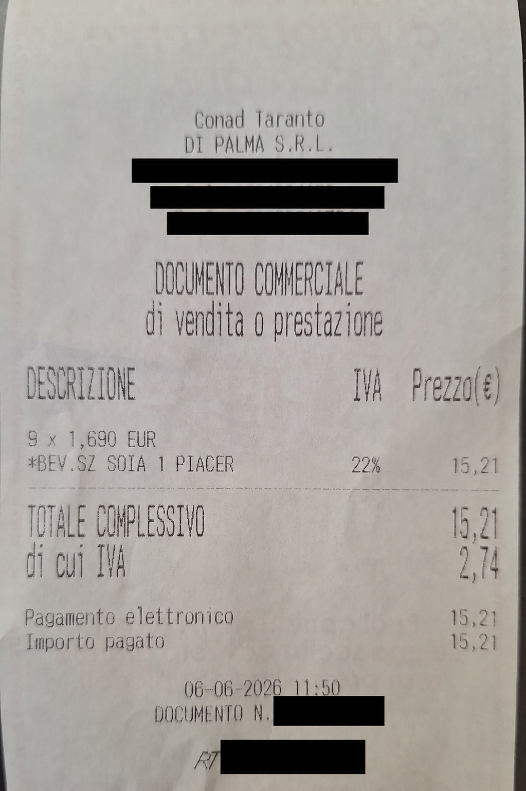
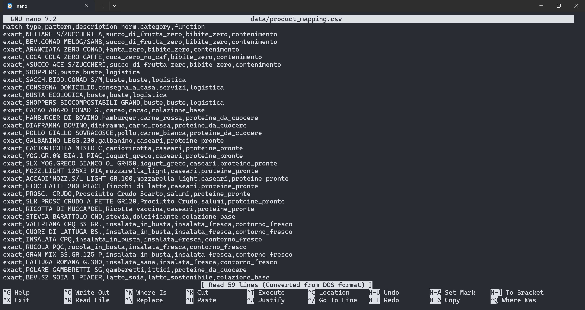
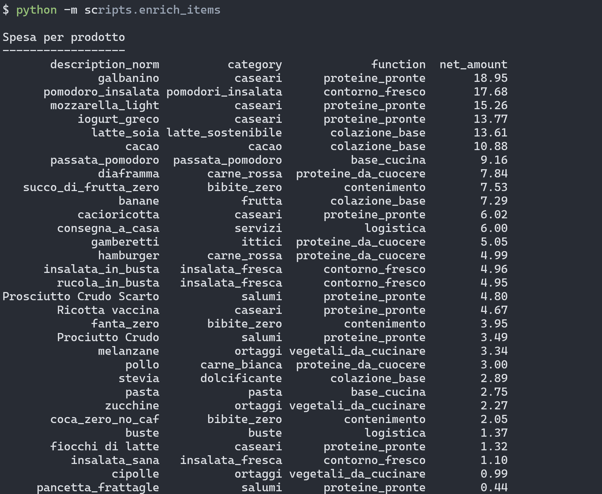
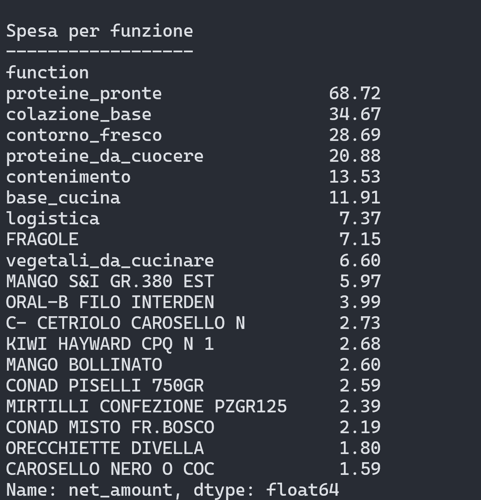

# Spesa

A local pipeline for transforming grocery receipt photos into structured, verifiable and analyzable data.

The project started from a personal need: understanding where my grocery budget actually goes without relying on proprietary applications or manual data entry.

## Motivation

I wanted a detailed breakdown of my grocery spending.

For years, my understanding of where my money went was approximative. I knew the total amount, but I had no reliable way to answer questions such as:


* How much do specific dietary choices actually cost?
* Which categories consume the largest share of my budget?
* Which products do I buy most often?
* How do prices change over time?
* given an item, could I buy it cheaper in a different shop ?


The workflow is intentionally simple:

* I take a photo of every receipt.
* Syncthing automatically transfers the images from my phone to my PC.
* An OpenAI model performs OCR transcription.
* A local parser reconstructs products, quantities, discounts and totals.
* The resulting data can be analyzed with tools such as jq, pandas or SQLite.

The goal is not OCR itself.

The goal is to build a reliable dataset of personal spending data.

---

## Design Principle

Every stage of the pipeline produces an inspectable artifact.

There are no opaque transformations:

```text
photo → OCR output → parsed JSON → analysis
```

Each stage can be inspected, validated, corrected or re-executed independently.

This principle drives the entire architecture of the project.

---

## Technical aspects

This project includes:

* extraction of structured data from semi-structured documents
* ETL pipeline design
* deterministic parsing
* JSON-based data modeling
* data normalization and classification
* automated consistency validation
* regression testing with versioned fixtures

The goal is not to showcase a particular technology.

The goal is to build an observable and verifiable pipeline that transforms unstructured data into analyzable datasets.

---

## Architecture

OCR and semantic interpretation are completely separated.

The AI model is responsible only for faithfully transcribing the receipt line by line.

The transformation into structured data is performed entirely by local deterministic code.

### Why not let the LLM do everything?

An LLM is excellent at reading receipts.

It is much less reliable when it has to:

* interpret quantities
* associate discounts with products
* validate totals
* maintain consistent behavior over time

An early version of the project delegated semantic interpretation to the model.

While the results were often correct, they were difficult to validate and not fully reproducible.

In particular, the model occasionally struggled with:

* promotional discounts
* multi-quantity purchases
* relationships between related lines
* accounting consistency checks

I therefore adopted a different architecture:

* OCR performed by the model
* parsing performed by deterministic code

This separation reduces complexity and makes the system testable, observable and reproducible.

After all, parsing existed long before AI.

---

## Real Example

The following anonymized receipt is a real input processed by the pipeline:



### OCR Output

```json
{
  "raw_lines": [
    "9 x 1,690 EUR",
    "*BEV.SZ SOIA 1 PIACER 22% 15,21",
    "TOTALE COMPLESSIVO 15,21",
    "di cui IVA 2,74",
    "Pagamento elettronico 15,21",
    "Importo pagato 15,21"
  ]
}
```

### Parsed Output

```json
{
  "description": "*BEV.SZ SOIA 1 PIACER",
  "quantity": 9,
  "unit_price": 1.69,
  "net_amount": 15.21
}
```

This example highlights a common receipt pattern: quantity and unit price are printed on one line, while the product description and total amount appear on the next one.

---

## Processing Flow

```text
receipt photo
    ↓
   OCR
    ↓
raw JSON
    ↓
deterministic Python parser
    ↓
validated structured JSON
```

---

## Philosophy

* OCR separated from semantics
* observable pipeline
* deterministic local parsing
* no opaque model reasoning
* mathematical validation of totals
* inspectable outputs
* versioned fixtures
* regression testing with pytest

---

## Product Taxonomy

Products are progressively normalized and classified through an explicit CSV-based mapping.

This allows multiple receipts to converge toward a consistent internal representation while keeping the classification process transparent and editable.



---

## Project Structure

```text
fixtures/             versioned test fixtures
logs/                 local logs
scripts/              Python scripts
scontrini_originali/  original receipt images
parsed_receipts/      parsed output (gitignored)
tests/                pytest test suite
trascrizioni/         raw OCR JSON (gitignored)
```

---


## Requirements

* Python 3.12+
* uv
* OpenAI API key (only for OCR functionality)
* Ubuntu or WSL recommended

---

## Setup

Install dependencies using uv:

```bash
uv sync
```

Create a `.env` file:

```text
OPENAI_API_KEY=...
```

Activate the virtual environment if desired:

```bash
source .venv/bin/activate
```

Alternatively, commands can be executed directly through uv:

```bash
uv run <command>
```

---

## Usage

Process a single receipt:

```bash
python -m scripts.processa_scontrino scontrini_originali/RECEIPT.heic
```

Outputs:

```text
trascrizioni/RECEIPT.json
parsed_receipts/RECEIPT.parsed.json
```

---

## Analysis

Once parsed, receipts can be analyzed using pandas, jq or any other data-processing tool.

### Spending by Product



### Spending by Function

Products are grouped not only by product category but also by practical function.

Examples include:

* ready_to_eat_protein
* protein_to_cook
* breakfast_base
* fresh_side_dish
* cooking_staples

This additional semantic layer makes it possible to analyze spending habits in terms of actual usage rather than purely commercial categories.



---

## Raw OCR Format

The OCR stage only returns raw text lines:

```json
{
  "raw_lines": [
    "MANGO S&I GR.380 EST 4% 4,78",
    "2 x 2,39 EUR"
  ]
}
```

No semantic interpretation is delegated to the model.

---

## Parsing

The local parser reconstructs:

* products
* quantities
* unit prices
* discounts
* totals
* accounting validation

Example:

```json
{
  "description": "MANGO S&I GR.380 EST",
  "quantity": 2.0,
  "unit_price": 2.39,
  "price": 4.78
}
```

---

## Validation

The parser verifies that:

```text
sum(items) + discounts == receipt total
```

Example:

```json
{
  "validation": {
    "match_total": true
  }
}
```

---

## Testing

Run the test suite:

```bash
uv run pytest -v
```

The public test suite does not require:

* real receipts
* OpenAI API access
* OCR execution

Versioned fixtures ensure that future parser changes do not break previously supported receipt formats.

---

## Current Status

Currently supports:

* Conad receipts
* Dok receipts
* multiline quantities (`2 x 2,39 EUR`)
* discounts
* total validation

---

## Roadmap

Planned improvements:

* support for additional supermarket chains
* expanded product categorization
* historical price analysis
* SQLite export
* Beancount integration
* protein cost analytics

---


## License

This project is licensed under the GNU Affero General Public License v3.0 (AGPL-3.0).

You are free to use, study, modify and redistribute this software under the terms of the license.

The AGPL extends the copyleft requirements to network use, ensuring that modified versions made available as a service remain free software and that corresponding source code remains available to users.
