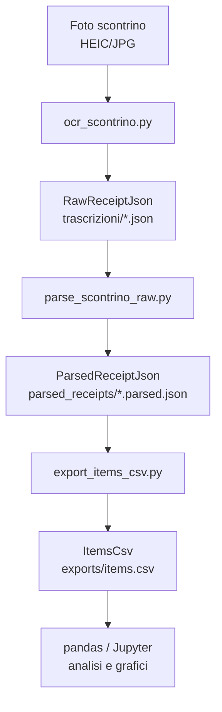
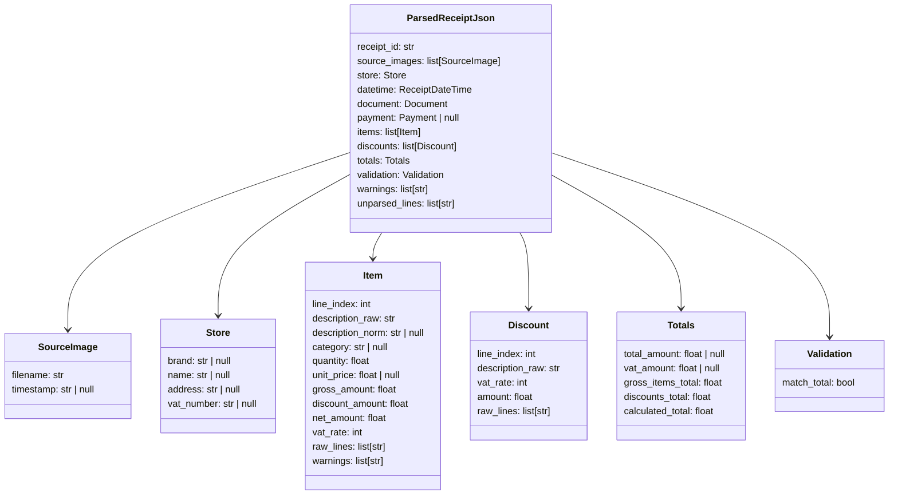

# Modello dati del progetto "spesa"

## Obiettivo

Il progetto trasforma fotografie di scontrini in dati strutturati
analizzabili con Python/pandas.

Pipeline generale:



---

# Livelli del pipeline

## 1. Immagini originali

Directory:

```text
scontrini_originali/
```

Formato:

```text
HEIC / JPG / PNG
```

Rappresentano le fotografie originali degli scontrini.

Uno stesso scontrino può richiedere più immagini.

---

## 2. RawReceiptJson

Prodotto da:

```text
scripts/ocr_scontrino.py
```

Directory:

```text
trascrizioni/
```

Esempio:

```json
{
  "raw_lines": [
    "Conad Gotham",
    "Gotham II S.R.L.",
    "DOCUMENTO COMMERCIALE",
    "MANGO S&I GR.380 EST 4% 4,78",
    "2 x 2,39 EUR",
    "TOTALE COMPLESSIVO 10,17"
  ]
}
```

Scopo:

- OCR puro
- nessuna interpretazione semantica
- preservare il testo grezzo
- massima osservabilità/debuggabilità

Questo livello NON deve:

- classificare prodotti
- associare sconti
- interpretare categorie
- validare totali

---

## 3. ParsedReceiptJson

Prodotto da:

```text
scripts/parse_scontrino_raw.py
```

Directory:

```text
parsed_receipts/
```

Rappresenta uno scontrino semanticamente parsato.

Schema concettuale:



---

# Concetti importanti

## source_images

Uno scontrino può essere composto da più immagini.

Per questo:

```text
immagine != scontrino
```

Esempio:

```json
"source_images": [
  {
    "filename": "20260527_194533.heic",
    "timestamp": "2026-05-27T19:45:33"
  },
  {
    "filename": "20260527_194601.heic",
    "timestamp": "2026-05-27T19:46:01"
  }
]
```

In futuro più immagini verranno aggregate in un singolo
scontrino usando euristiche temporali.

---

## items

Rappresentano articoli acquistati.

Gli importi attuali sono:

```text
gross_amount
```

ovvero importi lordi non ancora corretti dagli sconti.

Gli sconti sono ancora separati.

---

## discounts

Attualmente gli sconti NON sono allocati agli articoli.

Quindi:

```text
net_amount == gross_amount
```

per quasi tutti gli item.

La validazione totale però considera già gli sconti.

---

## warnings

I warning sono fondamentali.

Il parser deve preferire:

```text
warning strutturato
```

piuttosto che:

```text
fallimento totale
```

Esempi:

```text
punto_vendita_non_identificato
totale_non_validato
totale_mancante
sconti_non_ancora_allocati_agli_articoli
```

---

# 4. ItemsCsv

Prodotto da:

```text
scripts/export_items_csv.py
```

Directory:

```text
exports/
```

Formato:

```text
una riga = un articolo acquistato
```

Schema previsto:

```text
receipt_id
receipt_date
receipt_time
store_brand
store_name
store_address
source_image_count
primary_source_image
line_index
description_raw
description_norm
category
quantity
unit_price
gross_amount
discount_amount
net_amount
vat_rate
parser_warning
```

---

# 5. Analisi dati

Strumenti previsti:

- pandas
- Jupyter
- matplotlib / plotly

Esempi di analisi future:

- spesa totale per categoria
- spesa totale per supermercato
- classifica prodotti più acquistati
- andamento temporale
- grafici a torta
- prezzi medi per prodotto
- variazioni di prezzo nel tempo

Esempio:

```python
df.groupby("category")["net_amount"].sum()
```

oppure:

```python
df.groupby("description_raw")["net_amount"].sum()
```

---

# Filosofia architetturale

Il progetto privilegia:

- pipeline esplicite
- osservabilità
- debug semplice
- separazione OCR/parsing
- trasformazioni deterministiche
- dati ispezionabili
- warning strutturati
- recuperabilità dopo errori

Il parser deve essere:

```text
esplicito > magico
osservabile > opaco
robusto > elegante
```
